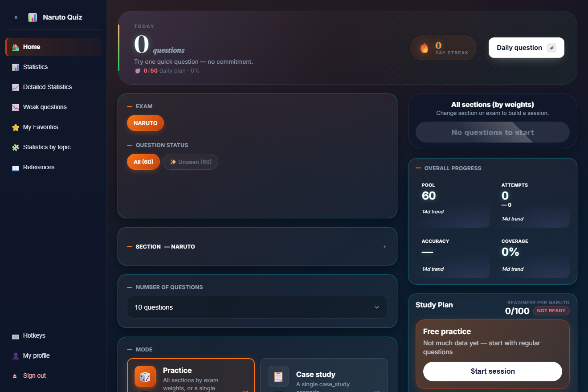
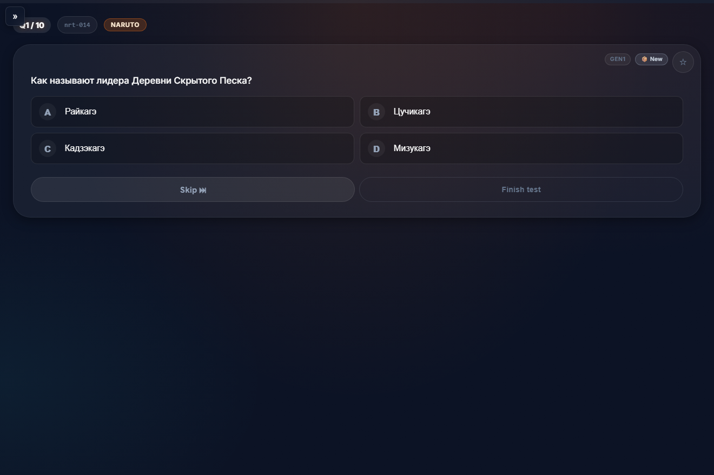
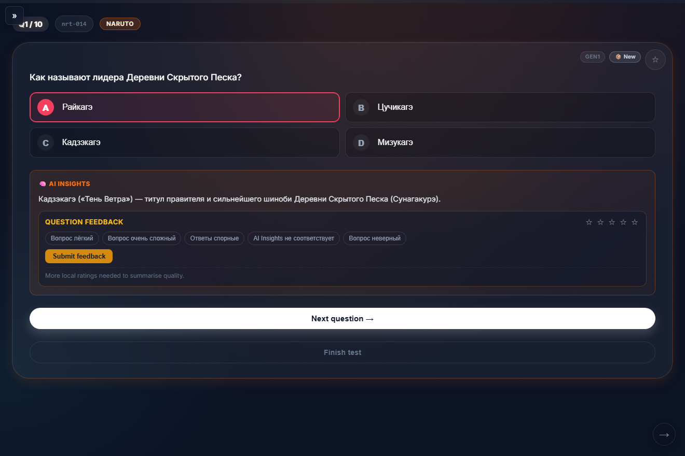
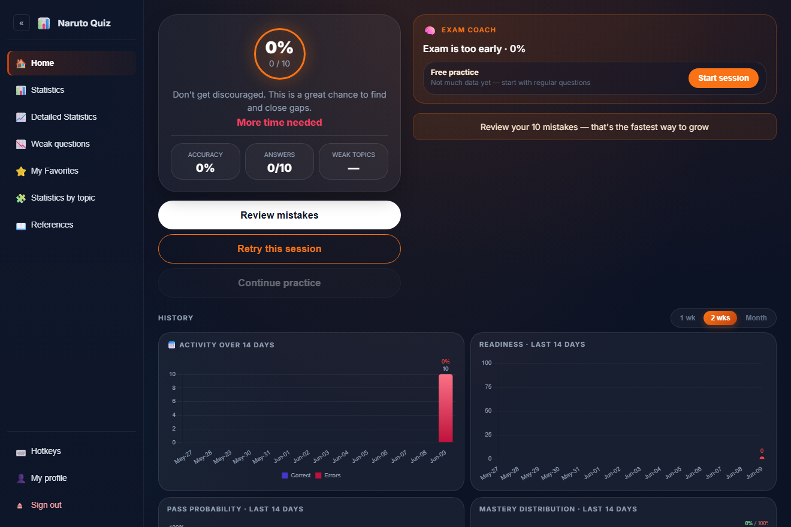
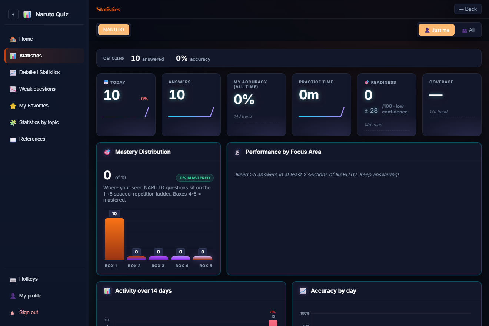
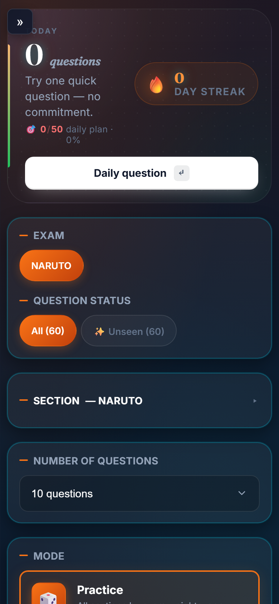

# 🍥 Pop-Culture Quiz — an adaptive‑learning PWA on a free serverless stack

A fast, installable **Progressive Web App** for testing knowledge across pop-culture universes: **Naruto**, **Demon Slayer**, **Marvel**, **DC Comics**, **Bridgerton**, **Squid Game** and **Music** (240 questions total). It looks like a simple trivia game, but under the hood it runs a full **adaptive learning engine** — spaced repetition, readiness scoring, weak‑area detection and a recommendation system — entirely on **free‑tier** infrastructure (Cloudflare Workers + Firebase Spark).

This repository is published as a **learning project**: a worked example of how to build a polished, secure, offline‑capable web app with **zero framework** and **zero monthly cost**.

🔗 **Live demo:** https://naruto.ms-cert.workers.dev

<p align="center">
  
</p>

---

## ✨ What makes it interesting

This isn't a `if (answer === correct)` toy. The quiz is driven by a small **learning engine** ([`src/engine/`](src/engine/)) originally built for certification‑exam prep and repurposed here:

| Concept | Where | What it does |
|---|---|---|
| **Spaced repetition (Leitner)** | `src/app.js` (`leitner` store) | Each question lives in a 1–5 box ladder; correct answers promote it, mistakes demote it, and review timing follows the box. |
| **Readiness scoring** | [`src/engine/readiness.js`](src/engine/readiness.js) | Combines accuracy, mastery and "due pressure" into a 0–100 score with a confidence level and a 95% bootstrap confidence interval. |
| **Recommendation engine** | [`src/engine/recommendation.js`](src/engine/recommendation.js) | Picks your next best action (review weak topics / drill a section / smart mix) and builds a layered study plan. |
| **Weak‑area detection** | `src/ui/remediation.js` | Surfaces the exact questions and sections dragging your score down. |

Everything is explainable — the readiness breakdown tells you *why* your score is what it is.

---

## 📸 Screenshots

| Quiz | Answer + AI insight |
|---|---|
|  |  |

| Session results & coach | Statistics dashboard |
|---|---|
|  |  |

<p align="center">
  
  <br><em>Fully responsive — installable as a PWA on mobile.</em>
</p>

---

## 🧱 Tech stack

- **Frontend:** Vanilla **JavaScript (ES modules)**, no framework. ~10k lines of plain JS, Chart.js for visualisations.
- **Hosting / edge:** **Cloudflare Workers** static assets + a **Durable Object** for per‑IP rate limiting.
- **Auth & data:** **Firebase** — Google Sign‑In + **Cloud Firestore** for progress, analytics and event logging.
- **Offline:** Service Worker (`sw.js`) + Web App Manifest → installable, works offline.
- **Tests:** **Playwright** end‑to‑end smoke tests ([`tests/e2e/`](tests/e2e/)).

> **No build step.** The app is served as‑is — open `index.html` and it runs. This keeps the project approachable and the deploy trivial.

---

## 🏛️ Architecture & key decisions

```
Browser (PWA)
  │
  ├─ index.html + src/app.js ............ UI, quiz flow, charts
  ├─ src/engine/* ...................... readiness · recommendation · spaced repetition
  ├─ src/firebase-init.js .............. Google Auth + Firestore client
  │
  ▼
Cloudflare Worker (_worker.js)
  ├─ static asset delivery (env.ASSETS)
  ├─ hotlink protection (referer check)
  └─ per‑IP rate limit  →  Durable Object (_rate-limiter.js)
  │
  ▼
Firebase
  ├─ Google Authentication
  └─ Cloud Firestore  (rules: firestore.rules)
```

**Decision 1 — Stay on the free tier.** Firebase's free **Spark** plan can't deploy Cloud Functions. Instead of paying for Blaze, the question bank is loaded as a **static JSON fetch** (`data/questions.v2.json`) and analytics are written **directly** to Firestore from the client, gated by security rules. A Cloud Functions code path still exists as an optional fallback ([`functions/`](functions/)) for anyone on Blaze.

**Decision 2 — Security at the edges, not the client.** Because writes go straight from the browser to Firestore, **[`firestore.rules`](firestore.rules) is the real security boundary** — every collection is locked to its owner (`request.auth.uid`), event writes are validated against the caller's uid to prevent spoofing, and config is read‑only. The client is treated as untrusted; data isolation is enforced server‑side regardless of what the browser claims.

**Decision 3 — Edge logic without a backend.** The Cloudflare Worker ([`_worker.js`](_worker.js)) adds referer‑based **hotlink protection** and a **50 req/min per‑IP** rate limit via a Durable Object, with optional Telegram alerts on suspicious traffic — a compact example of running logic at the edge with no server. (The quiz is now text‑only, so this layer mainly stands as a reusable rate‑limiting pattern rather than guarding image assets.)

---

## 🔐 Security model (what to study here)

This project is a good case study in **client‑heavy app security**:

- **Trust boundary:** the client is untrusted. All authorisation lives in [`firestore.rules`](firestore.rules) and [`storage.rules`](storage.rules).
- **Per‑user isolation:** `users/{uid}/**`, `analytics/{uid}` and reflections are readable/writable only by their owner.
- **Anti‑spoofing:** the append‑only `events` collection validates `request.resource.data.uid == request.auth.uid` so a logged‑in user can't forge events for someone else.
- **No secrets in the repo:** the Firebase web `apiKey` is public **by design** (Firebase keys are project identifiers, not credentials — protection comes from Auth + rules). Telegram bot tokens are injected via `wrangler secret`, never committed.
- **Known trade‑off:** shared aggregate counters (`daily_stats`, `question_stats`) are writable by any signed‑in user — Firestore rules can't distinguish an `increment()` from an overwrite, so hardening those would require server‑side aggregation (documented inline in the rules file).

---

## 🚀 Run it locally

No build, no install for the app itself — just a static file server:

```bash
# Python (built in)
python -m http.server 8000

# …or Node
npx http-server -p 8000 -c-1
```

Then open **http://localhost:8000**.

> On `localhost` the app enables a **dev bypass** so you can explore the full UI without configuring Firebase — it loads questions from the local JSON and skips Google Sign‑In.

### End‑to‑end tests

```bash
npm install          # dev dependency: Playwright
npx playwright install chromium
npm run test:e2e
```

---

## ✍️ Editing the question bank

All questions live in [`data/questions.v2.json`](data/questions.v2.json) (240 questions across 7 topics). Each follows this shape:

```json
{
  "id": "nrt-051",
  "exam_code": "NARUTO",
  "section": "easy",
  "options": ["Option A", "Option B", "Option C", "Option D"],
  "correct": 2,
  "prompt": "Question text?",
  "explanation": "Why this answer is correct."
}
```

- **`section`** — difficulty: `easy`, `medium`, or `hard` (drives the section weights in [`src/config/exam-profiles.js`](src/config/exam-profiles.js)).
- **`correct`** — 0‑indexed correct option (0–3).
- **`prompt` / `explanation`** — shown to the learner during and after answering.

---

## ⚡ Deploy

```bash
# 1. Sync the question bank into the functions bundle (Blaze fallback only)
node functions/sync-data.js

# 2. Ship the frontend to Cloudflare Workers
npx wrangler deploy

# 3. Publish Firestore security rules (after editing firestore.rules)
firebase deploy --only firestore:rules
```

---

## 📂 Repository layout

| Path | Purpose |
|------|---------|
| `index.html` | SPA entry point |
| `src/app.js` | Core app logic — quiz flow, scoring, charts |
| `src/engine/` | Adaptive engine: readiness, recommendation, spaced repetition |
| `src/ui/` | UI modules: study plan, coach report, remediation cards |
| `src/config/exam-profiles.js` | Quiz profile (section weights, pacing) |
| `src/firebase-init.js` | Firebase Auth + Firestore client |
| `data/questions.v2.json` | Single source of truth for questions |
| `_worker.js` / `_rate-limiter.js` | Cloudflare Worker + Durable Object (hotlink/rate‑limit) |
| `firestore.rules` / `storage.rules` | Security boundaries |
| `tests/e2e/` | Playwright smoke tests |
| `functions/` | Optional Cloud Functions path (Blaze tier) |

---

## 📝 Notes

- UI chrome is in **English**; the quiz **content** (questions & explanations) is in **Russian** — it was built for a Russian‑speaking audience.
- The learning machinery (spaced repetition, readiness scoring, recommendations) is more sophisticated than a trivia game typically needs — that engineering depth is intentional and reusable.

## Author

Built by **Aziz** — [github.com/aznrz](https://github.com/aznrz)

## License

MIT © [Aziz](https://github.com/aznrz) — free to learn from, copy, and adapt. See [LICENSE](LICENSE).
